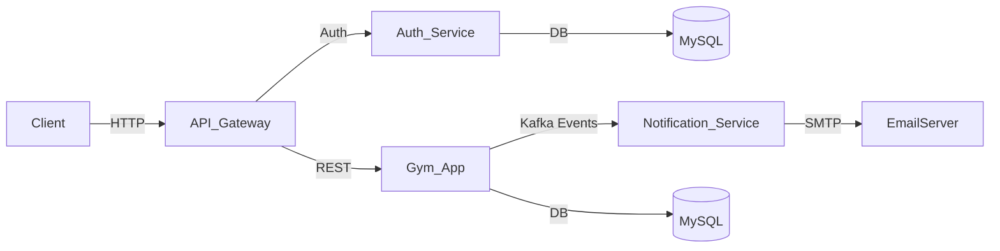

# Gym-Project

Este proyecto implementa un sistema de gestión de gimnasio basado en arquitectura de microservicios utilizando Spring Boot, Spring Cloud, Kafka, y JWT Authentication.
Permite la gestión de miembros, entrenadores, clases, horarios, registros, contratos y membresías, con envío de notificaciones automáticas y control de accesos mediante tokens JWT.

## Tecnologías y herramientas utilizadas
- Java 17
- Spring (Spring Boot, Spring Data JPA, Spring Cloud, Spring Security)
- Hibernate (para la persistencia de datos)
- MySQL (gestor para la base de datos de ppto-contrata)
- Maven (como gestor de proyectos)
- Apache Kafka
- Lombok
- JWT
- Docker

# Arquitectura General

| Microservicio            | Descripción                                                                                                                            |
| ------------------------ | -------------------------------------------------------------------------------------------------------------------------------------- |
| **auth-service**         | Gestiona la autenticación y los usuarios. Genera tokens JWT.                                                                           |
| **gym-app**              | Contiene la lógica principal del negocio (miembros, entrenadores, etc). Publica eventos hacia Kafka.                                   |
| **notification-service** | Escucha los eventos de `gym-app` a través de Kafka y envía correos electrónicos (notificaciones de registro y expiración de mebresía). |
| **api-gateway**          | Centraliza las peticiones y aplica filtros de autenticación/autorización.                                                              |


## Funcionalidades principales
- CRUD de presupuestos para los microservicios ppto-contrata y ppto-origen.
- Comunicación de microservicios mediante WebClient.
- Eureka Server para el registro de microservicios. 
- Config Server para centralizar la configuración de los microservicios.
- Api Gateway para el enrutamiento de las solicitudes.
- Patrón Circuit Breaker para evitar sobrecargar servicios que están temporalmente inactivos o con fallas.

## Arquitectura



#Flujo:
El usuario realiza solicitudes al API Gateway, que enruta hacia los microservicios (ppto-origen o ppto-contrata). Estos se comunican con sus respectivas bases de datos y utilizan el Config-server para cargar su configuración. Ambos microservicios están registrados en Eureka-server para el descubrimiento dinámico.

## Ejecución del proyecto

### 1. Clonar el repositorio
```bash
git clone https://github.com/wilfredohuarotog/Microservicios-Gestion-de-presupuestos.git
```
### 2. Ingresar al directorio
```
cd Microservicios-Gestion-de-presupuestos
```
### 3. Ejecutar para cada microservicio:

Levantar cada microservicio en consolas separadas.

- Config-server:
```
mvn spring-boot:run -pl config-server
```
- Eureka-server:
```
mvn spring-boot:run -pl eureka-server
```
- Api-gateway:
```
mvn spring-boot:run -pl gateway
```
- Ppto-origen:
```
mvn spring-boot:run -pl ppto-origen
```
- Ppto-contrata:
```
mvn spring-boot:run -pl ppto-contrata
```

## Uso
- Los microservicio ppto-origen y ppto-contrata permiten operaciones CRUD.
- Todos los endpoints de los microservicios se consumen a través del Gateway `http://localhost:8080`.
### Microservicio ppto-origen

| Método | Endpoint                | Descripción                             |
| ------ | ----------------------- | --------------------------------------- |        
| GET    | `/api/v1/p-origen`      | Obtener todos los pptos origen   |
| GET    | `/api/v1/p-origen/{id}` | Obtener un ppto origen por ID    |
| POST   | `/api/v1/p-origen`      | Crear un nuevo ppto origen       |
| PUT    | `/api/v1/p-origen/{id}` | Actualizar un ppto origen por ID |
| DELETE | `/api/v1/p-origen/{id}` | Eliminar un ppto origen por ID   |
| GET    | `/api/v1/p-origen/p-contrata/{id}` | Obtener pptos de contrata asociados a un ppto origen  |

### Microservicio ppto-contrata

| Método | Endpoint                           | Descripción                                            |
| ------ | ---------------------------------- | ------------------------------------------------------ |
| GET    | `/api/v1/p-contrata`               | Obtener todos los pptos de contrata             |
| GET    | `/api/v1/p-contrata/{id}`          | Obtener un ppto de contrata por ID              |
| POST   | `/api/v1/p-contrata`               | Crear un nuevo ppto de contrata                 |
| PUT    | `/api/v1/p-contrata/{id}`          | Actualizar un ppto de contrata por ID           |
| DELETE | `/api/v1/p-contrata/{id}`          | Eliminar un ppto de contrata por ID             |
| GET    | `/api/v1/p-contrata/p-origen/{id}` | Obtener pptos de contrata asociados a un ppto origen |

### Documentación
`Acceder:` [Documentación en Postman](https://documenter.getpostman.com/view/46041910/2sB3QFRCPr)

