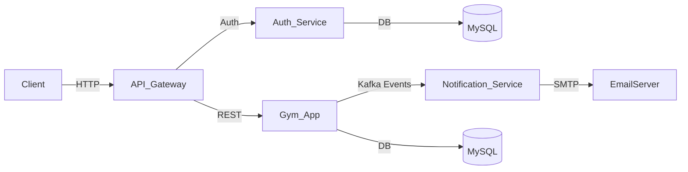

# Gym-Project

Este proyecto implementa un sistema de gestión de gimnasio basado en arquitectura de microservicios utilizando Spring Boot, Spring Cloud, Kafka, y JWT Authentication.
Permite la gestión de miembros, entrenadores, clases, horarios, registros, contratos y membresías, con envío de notificaciones automáticas y control de accesos mediante tokens JWT.

## Tecnologías y herramientas utilizadas
- Java 17
- Spring (Spring Boot, Spring Data JPA, Spring Cloud, Spring Security)
- Hibernate (para la persistencia de datos)
- MySQL (gestor para la base de datos de ppto-contrata)
- Maven (como gestor de proyectos)
- Apache Kafka (mensajería entre microservicios)
- Lombok (reducción de código)
- JWT (autenticación y autorización)
- Docker (contenedorización)

# Arquitectura General

| Microservicio            | Descripción                                                                                                                            |
| ------------------------ | -------------------------------------------------------------------------------------------------------------------------------------- |
| **auth-service**         | Gestiona la autenticación y los usuarios. Genera tokens JWT.                                                                           |
| **gym-app**              | Contiene la lógica principal del negocio (miembros, entrenadores, etc). Publica eventos hacia Kafka.                                   |
| **notification-service** | Escucha los eventos de `gym-app` a través de Kafka y envía correos electrónicos (notificaciones de registro y expiración de mebresía). |
| **api-gateway**          | Centraliza las peticiones y aplica filtros de autenticación/autorización.                                                              |

## Diagrama de arquitectura



## Ejecución del proyecto

### 1. Clonar el repositorio
```bash
git clone https://github.com/wilfredohuarotog/Gym-Project.git
```
### 2. Ingresar al directorio
```
cd Gym-Project
```
### 3. Configuración de variables de entorno del application.properties

- Para gym-app y auth-service configurar la conexión a la base de datos.
```
spring.datasource.url=${DB_URL}
spring.datasource.username=${DB_USER}
spring.datasource.password=${DB_PASSWORD}
```
- Para auth-service y api-gateway definir su clave secreta para la generación/validación del JWT.
```
security.key = ${SECRET_KEY}
```
- Para el notification-service definir las credenciales.
```
spring.kafka.mail.username = ${EMAIL_USERNAME}
spring.kafka.mail.username = ${EMAIL_PASSWORD}
```
### 4. Levantar los microservicios

Consideraciones previas:
- Asegúrate de tener Kafka corriendo localmente o en Docker.
- Crea las bases de datos necesarias (por ejemplo auth_db y gym_db).

## Despliegue en Docker

### 1. Generar las imagenes y levantar el servicios del docker-compose.yml
```
docker compose up -build -d
```
### 2. Detener la ejecución
```
docker compose down
```

## Uso

- Todos los endpoints de los microservicios se consumen a través del Gateway `http://localhost:8080`.

### Autenticación

El flujo de autenticación es manejado por auth-service:

- Endpoint de login: `POST /api/v1/auth/login`.
```json
{
  "username": "wilfredo",
  "password": "1234"
}
```
Devuelve un Token JWT.

- Endpoint de registro: `POST /api/v1/auth/register`.
```json
{
  "username": "Alsson",
  "password": "ali23",
  "age": 28,
  "email": "alison@gmail.com",
  "role": "USER"
}
```
Devuelve un Token JWT.

- Usa el token JWT en el header para acceder a los demás endpoints:
```
Authorization: Bearer <tu_token>
```

### Endpoints principales - gym-app

| Método   | Endpoint               | Descripción                    | Rol          |
| -------- | ---------------------- | ------------------------------ | ------------ |
| `GET`    | `/api/v1/gym/member`      | Listar todos los miembros      | ADMIN / USER |
| `POST`   | `/api/v1/gym/member`      | Registrar nuevo miembro        | ADMIN / USER |
| `PUT`    | `/api/v1/gym/member/{id}` | Actualizar datos de un miembro | ADMIN / USER |
| `DELETE` | `/api/v1/gym/member/{id}` | Eliminar miembro               | ADMIN / USER |
| `GET`    | `/api/v1/gym/member/search?dni=(el_dni)` | Verficiar estado del miembro por su DNI | ADMIN / USER |
| `GET`    | `/api/v1/gym/coach`      | Listar entrenadores            | ADMIN |
| `POST`   | `/api/v1/gym/class`      | Crear clase                    | ADMIN |
| `POST`   | `//api/v1/gym/registration` | Crear el registro de un usuario para una clase | ADMIN / USER |

### Ejemplo de flujo
1. Login con el usuario `wilfredo / 1234` → obtén el token.
2. Usa el token para crear un nuevo miembro.
3. El **gym-app** envía un evento a Kafka.
4. El **notification-service** escucha el evento y envía un correo al miembro.

